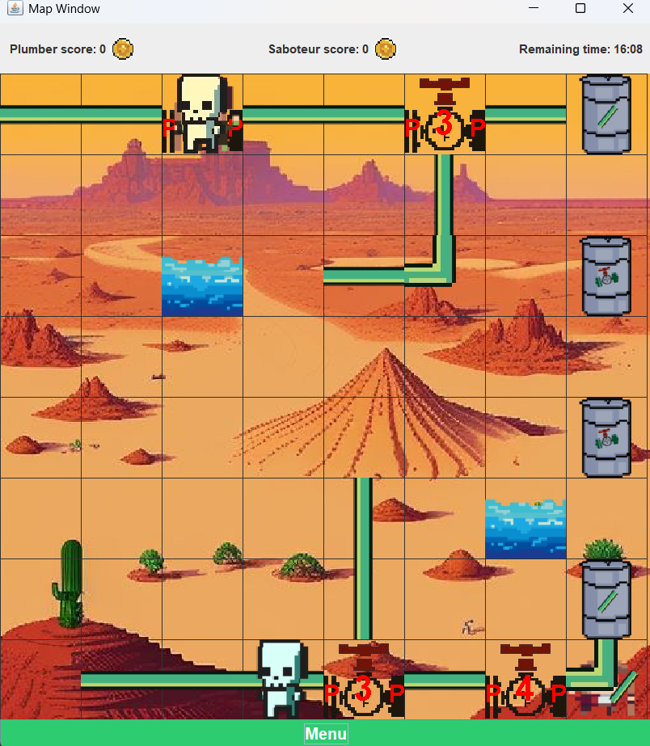
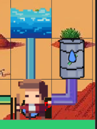
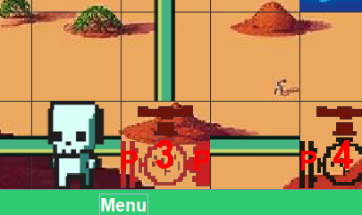

# Pipes in the Desert

A strategic multiplayer water pipe management game where plumbers work to transport water from springs to cisterns while saboteurs attempt to disrupt their efforts.

## Table of Contents
- [Pipes in the Desert](#pipes-in-the-desert)
  - [Table of Contents](#table-of-contents)
  - [Game Overview](#game-overview)
  - [Features](#features)
  - [System Requirements](#system-requirements)
  - [Installation](#installation)
  - [How to Run](#how-to-run)
  - [Gameplay](#gameplay)
    - [Objective](#objective)
    - [Game Flow](#game-flow)
  - [Controls](#controls)
    - [Plumber Controls](#plumber-controls)
    - [Saboteur Controls](#saboteur-controls)
  - [Game Mechanics](#game-mechanics)
    - [Components](#components)
      - [Springs](#springs)
      - [Pipes](#pipes)
      - [Pumps](#pumps)
      - [Cisterns](#cisterns)
    - [Water Flow System](#water-flow-system)
    - [Sandstorms](#sandstorms)
    - [Scoring System](#scoring-system)
  - [Contributing](#contributing)
  - [Project Structure](#project-structure)

## Game Overview

**Pipes in the Desert** is a real-time strategy game where two teams compete in a desert environment:
- **Plumber Team**: Works to build and maintain a water distribution network to fill cisterns
- **Saboteur Team**: Attempts to sabotage the water network by breaking pipes and disrupting water flow

The game features dynamic water flow simulation, component manufacturing, random sandstorm events, and strategic pipe network management.

## Features

- **Team-based Multiplayer**: 2 Plumbers vs 2 Saboteurs
- **Real-time Gameplay**: Players alternate control every 15 seconds
- **Dynamic Water Flow**: Realistic water flow simulation through pipe networks
- **Component System**: Pipes, pumps, springs, and cisterns with different properties
- **Manufacturing**: Cisterns automatically manufacture new components over time
- **Environmental Events**: Random sandstorms that can break pumps
- **Strategic Gameplay**: Multiple ways to win - fill all cisterns or prevent water flow
- **Visual Interface**: Java Swing-based GUI with grid-based movement

## System Requirements

- **Java Runtime Environment (JRE) 8 or higher**
- **Operating System**: Windows, macOS, or Linux
- **Memory**: 512 MB RAM minimum
- **Display**: 1024x768 resolution or higher
- **Input**: Keyboard and mouse

## Installation

1. **Download the project**:
   ```bash
   git clone https://github.com/mMelnic/pipes-in-the-desert-game.git
   cd pipes-in-the-desert-game
   ```

2. **Ensure Java is installed**:
   ```bash
   java -version
   ```
   If Java is not installed, download it from [Oracle's website](https://www.oracle.com/java/technologies/downloads/) or use OpenJDK.

3. **Compile the project**:
   ```bash
   # Navigate to the src directory
   cd src
   
   # Compile all Java files
   javac -cp . **/*.java
   ```

## How to Run

1. **Start the game**:
   ```bash
   # From the src directory
   java Main
   ```

2. **Alternative method** (if the above doesn't work):
   ```bash
   # From the project root directory
   cd src
   java -cp . Main
   ```

3. **The main menu will appear** with options to:
   - Start Game
   - View Key Bindings
   - Select Map Size
   - Exit
  
     

## Gameplay

### Objective
- **Plumbers**: Fill all cisterns with water by building and maintaining pipe networks
- **Saboteurs**: Prevent plumbers from achieving their goal by breaking pipes and disrupting water flow

### Game Flow
1. Players spawn on a grid-based map with pre-existing pipes, pumps, springs, and cisterns
2. Control alternates between team members every 15 seconds
3. Cisterns manufacture new components (pipes/pumps) every 10 seconds
4. Random sandstorms occur that can damage pumps connected to water flow
5. Game ends when all cisterns are full (plumbers win) or time runs out

     

## Controls

### Plumber Controls
**Movement:**
- `↑` `↓` `←` `→`: Move in respective directions

**Actions:**
- `Enter`: Repair broken pipe or pump
- `.` (period): Pick up component from nearby cistern
- `/` (slash): Install carried component in facing direction
- `,` (comma): Drop carried component
- `Shift`: Switch to ACTION mode

**ACTION Mode (Hold Shift + Arrow Keys):**
- **On Pump**: Press two arrow keys simultaneously to redirect water flow between pipes
- **On Pipe**: Press two arrow keys to detach pipe from one component and attach to another

**Mouse Controls:**
- Click on a pipe, then click on a nearby spring/cistern to connect components

### Saboteur Controls
**Movement:**
- `W`: Move up
- `S`: Move down
- `A`: Move left
- `D`: Move right

**Actions:**
- `Q`: Puncture pipe (breaks the pipe and causes water leakage)
- `Shift`: Switch to ACTION mode (for advanced pipe redirections)

**Any 2 players cannot walk on a pipe at the same time but any number of players can stand on a pump simultaneously:**

 

## Game Mechanics

### Components

#### Springs
- **Function**: Source of water in the network
- **Behavior**: Automatically starts water supply when connected to pipes
- **Strategy**: Connect pipes to springs to begin water flow

    Water flow started from the spring:

     

#### Pipes
- **Function**: Transport water between components
- **States**: Normal, broken, leaking, full
- **Properties**: Can be connected in different shapes, leak when broken
- **Manufacturing**: Produced by cisterns every 10 seconds

    Example of filling pipe followed by a leaking pipe:

     

    Example of a full pipe and full cistern:

     

#### Pumps
- **Function**: Advanced water flow management with reservoir system
- **Properties**: Can connect multiple pipes, has reservoir that can fill up
- **States**: Normal, broken, reservoir full, leaking
- **Strategy**: Use to manage complex pipe networks and water pressure

    Example of leaking pump (turqoise):

     

    Example of broken pump (red):

     


#### Cisterns
- **Function**: Water collection endpoints and component factories
- **Behavior**: Fill with water when connected to active pipe network
- **Manufacturing**: Produces new pipes and pumps for plumbers to collect
- **Victory Condition**: Fill all cisterns to win as plumbers

    Example of filling cistern:

     

### Water Flow System
- Water flows from springs through connected pipes to cisterns
- Broken pipes leak water and reduce efficiency
- Pumps can store water in reservoirs and manage flow direction
- Free pipe ends (unconnected) cause water leakage

    Example of pump with switched input and output pipes(bottom right):

     

### Sandstorms
- Random events that occur during gameplay
- Can break pumps that are connected to active water flow
- Adds environmental challenge and unpredictability

     

### Scoring System
- **Plumber Score**: Based on successful water delivery and cistern filling
- **Saboteur Score**: Based on water leakage time and disruption caused

     

## Contributing

This project is part of a Software Project Lab course. If you'd like to contribute:

1. Fork the repository
2. Create a feature branch (`git checkout -b feature/new-feature`)
3. Commit your changes (`git commit -am 'Add new feature'`)
4. Push to the branch (`git push origin feature/new-feature`)
5. Create a Pull Request

## Project Structure

```
src/
├── Main.java                 # Main entry point
├── components/               # Game components (Pipe, Pump, Spring, Cistern)
├── enumerations/            # Direction, Shapes enums
├── exceptions/              # Custom game exceptions
├── GUI/                     # User interface components
│   ├── MainWindow.java      # Main menu
│   ├── MapWindow.java       # Game map display
│   ├── PlumberController.java    # Plumber input handling
│   ├── SaboteurController.java   # Saboteur input handling
│   └── ...                  # Other UI components
├── interfaces/              # Game interfaces
├── player/                  # Player classes and scoring
├── resources/               # Game images and assets
│   ├── images/              # Player and UI images
│   └── pipeImages/          # Pipe component images
└── system/                  # Core game systems
    ├── GameManager.java     # Main game logic controller
    ├── Map.java            # Game map and water flow
    └── ...                 # Other system components
```

---

**Note**: This is a university project developed for educational purposes as part of a Software Project Lab course. The game demonstrates object-oriented programming principles, design patterns, and collaborative software development practices.
